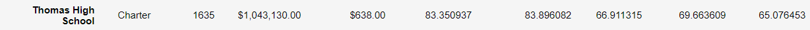

# School_District_Analysis

## Project Overview

This project is an analysis for an individual school district. The purpose is to create an detailed analyzation to get a better understanding of each school's performance relative to each other, and future budgeting prospects. The analyzation would also compare the results after Thomas High School's 9th grades were removed due to dishonesty questions. 

## Results

The calculated analysis are as follows:
 - The average math and reading scores received by students in each grade level of each school
 - Top 5 and bottom 5 schools based on passing rate
 - School performance based on budget per student
 - School performance based on the type of school
 - School performance based on the school population size

### How is the district summary affected?
 - After adjusting the district analysis and removing the Thomas High School's 9th grades' scores, the district summary has not been affected much. The overall passing percentage has gone down from 65% to 64.9%.

### How is the school summary affected?
 - After adjusting the school analysis, the school summary remains identical as a district. Thomas High School's summary has been altered trastically from 90.6$ to 65%.
  

 - After replacing the Thomas High School's 9th graders scores with only 10th to 12th grader's scores, the schools' overall passing percentage increased back to 91%.
 

###How did replacing the 9th grade scores affect school spending/school size/school type?
 - After the 9th grade scores were removed, the school spending, school size, and school type results didn't not change significantly. This is due to the large sample size compared to the much smaller sample size of the 9th graders in one school. If the sample pool removed were a larger, it would created a more significant impact on these generalization analyzations. 

## Summary
Some of the challenges after the ninth grader from Thomas High School's scores were removed were its affects in sorting data. NaN would create placeholders, as it won't be accounted for when calculating averages, but it would be accounted under a count(). Extra attention and data sorting were needed to avoid mistake as mentioned. 
Thomas High School's data was drastically changed, as a quarter of its data has been removed. Generalization calculations for the district remained the same due to the large sample size.

